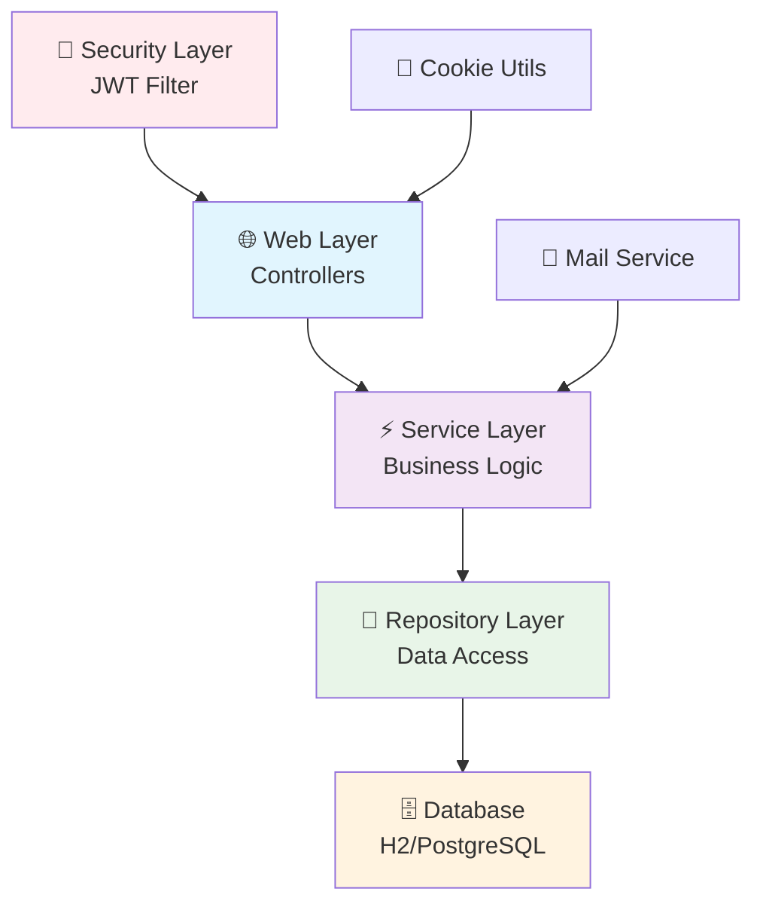
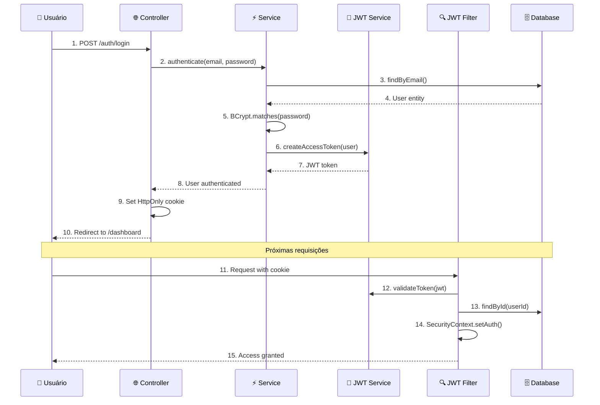
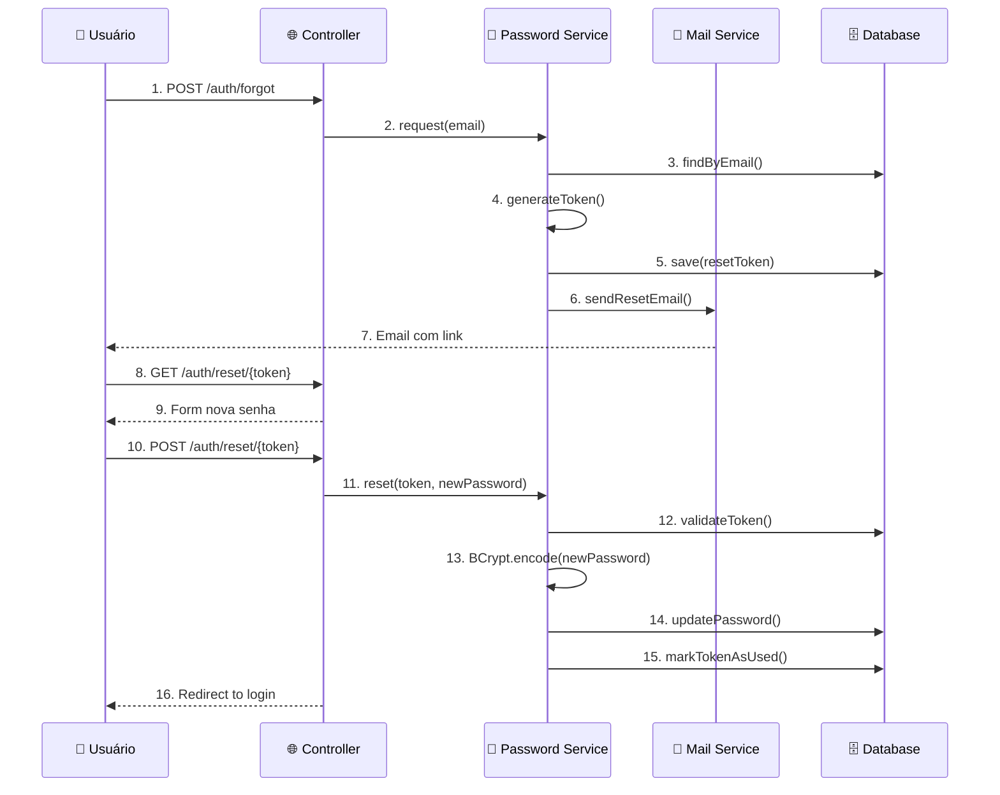
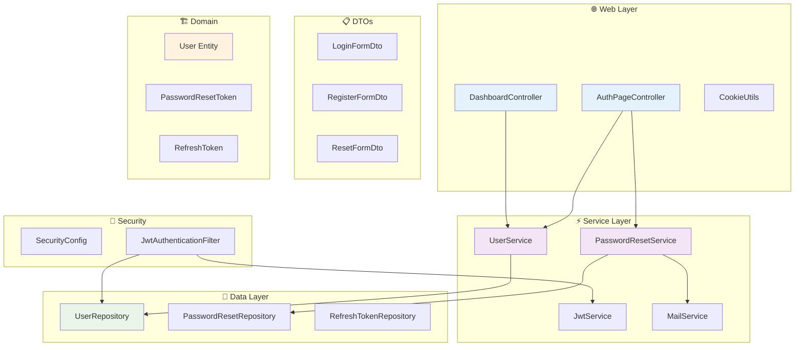
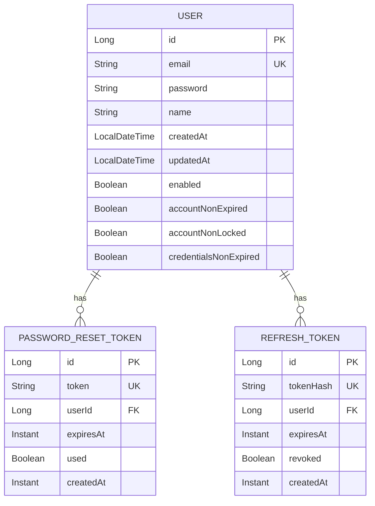

# 🔐 Sistema de Login e Autenticação Spring Boot

> Um sistema completo de autenticação com JWT, desenvolvido com Spring Boot 3 e as melhores práticas de segurança.


## 📋 Índice

- [🎯 Sobre o Projeto](#-sobre-o-projeto)
- [✨ Funcionalidades](#-funcionalidades)
- [🏗️ Arquitetura](#️-arquitetura)
- [🚀 Tecnologias](#-tecnologias)
- [📊 Diagramas](#-diagramas)
- [⚙️ Configuração](#️-configuração)
- [🔧 Instalação](#-instalação)
- [📖 Como Usar](#-como-usar)
- [🛡️ Segurança](#️-segurança)
- [📁 Estrutura do Projeto](#-estrutura-do-projeto)
- [🧪 Testes](#-testes)
- [📚 Aprendizados](#-aprendizados)
- [🤝 Contribuição](#-contribuição)

## 🎯 Sobre o Projeto

Este é um **sistema completo de autenticação e autorização** desenvolvido com Spring Boot, implementando as melhores práticas de segurança para aplicações web modernas. O projeto serve como base de estudos e referência para implementação de sistemas de login robustos.

### 🎓 Propósito Educacional

O projeto foi desenvolvido com **foco didático**, contendo comentários detalhados em português em todos os arquivos, explicando:
- **Conceitos do Spring Framework**
- **Padrões de arquitetura**
- **Boas práticas de segurança**
- **Como e por que cada implementação**

## ✨ Funcionalidades

### 🔑 Autenticação Completa
- ✅ **Cadastro de usuários** com validação
- ✅ **Login seguro** com Spring Security
- ✅ **Logout** com limpeza de sessão
- ✅ **Autenticação JWT** stateless

### 🔒 Gestão de Senhas
- ✅ **Hash BCrypt** para senhas
- ✅ **Esqueci minha senha** via email
- ✅ **Reset de senha** com token único
- ✅ **Tokens com expiração** configurável

### 🍪 Segurança de Cookies
- ✅ **HttpOnly cookies** (proteção XSS)
- ✅ **Secure flags** para HTTPS
- ✅ **SameSite** configurável (proteção CSRF)
- ✅ **Domínio específico** por ambiente

### 📧 Sistema de Email
- ✅ **Envio de emails** para reset de senha
- ✅ **Templates responsivos**
- ✅ **Integração Mailtrap** (desenvolvimento)
- ✅ **Configuração SMTP** flexível

## 🏗️ Arquitetura

O projeto segue a **arquitetura em camadas** do Spring Framework:



### 🔄 Fluxo de Autenticação JWT



### 🔄 Fluxo de Reset de Senha



## 🚀 Tecnologias

### 🎯 Core Framework
- **Spring Boot 3.5.6** - Framework principal
- **Spring Security 6** - Segurança e autenticação
- **Spring Data JPA** - Persistência de dados
- **Spring Web MVC** - Camada web

### 🗄️ Banco de Dados
- **H2 Database** - Desenvolvimento (in-memory)
- **JPA/Hibernate** - ORM
- **Flyway** - Migrations (opcional)

### 🎨 Frontend
- **Thymeleaf** - Template engine
- **Bootstrap** - CSS framework
- **HTML5/CSS3** - Estrutura e estilo

### 🔐 Segurança
- **JWT (JJWT)** - JSON Web Tokens
- **BCrypt** - Hash de senhas
- **CSRF Protection** - Proteção contra ataques
- **XSS Protection** - Headers de segurança

### 📧 Email
- **Spring Mail** - Envio de emails
- **Mailtrap** - Teste de emails (dev)
- **SMTP** - Protocolo de email

### 🧪 Testes
- **JUnit 5** - Testes unitários
- **Spring Boot Test** - Testes de integração
- **Mockito** - Mocks para testes

### 🔧 Ferramentas
- **Lombok** - Redução de boilerplate
- **Maven** - Gerenciamento de dependências
- **DevTools** - Hot reload em desenvolvimento

## 📊 Diagramas

### 🏛️ Arquitetura de Componentes



### 🔄 Modelo de Dados



## ⚙️ Configuração

### 📋 Pré-requisitos

- ☕ **Java 21+**
- 📦 **Maven 3.6+**
- 🌐 **IDE** (IntelliJ IDEA, VS Code, Eclipse)

### 🔧 Variáveis de Ambiente

```bash
# JWT Configuration
JWT_SECRET=your-base64-encoded-secret-key-here
JWT_ISSUER=your-app-name

# Database (Production)
DB_URL=jdbc:postgresql://localhost:5432/logindb
DB_USERNAME=your-db-user
DB_PASSWORD=your-db-password

# Email Configuration
SMTP_HOST=smtp.gmail.com
SMTP_PORT=587
SMTP_USERNAME=your-email@gmail.com
SMTP_PASSWORD=your-app-password

# Application URLs
BASE_URL=https://your-app.com
COOKIE_DOMAIN=.your-app.com
```

## 🔧 Instalação

### 1️⃣ Clone o repositório
```bash
git clone https://github.com/AROLima/login_module.git
cd login_module/login
```

### 2️⃣ Configure o ambiente
```bash
# Copie o arquivo de configuração
cp src/main/resources/application-dev.yml src/main/resources/application-local.yml

# Edite as configurações conforme necessário
# Principalmente: email (Mailtrap), JWT secret, URLs
```

### 3️⃣ Execute a aplicação
```bash
# Via Maven
./mvnw spring-boot:run

# Ou compile e execute
./mvnw clean package
java -jar target/login-0.0.1-SNAPSHOT.jar
```

### 4️⃣ Acesse a aplicação
- 🌐 **Aplicação**: http://localhost:8080
- 🗄️ **Console H2**: http://localhost:8080/h2-console
  - **JDBC URL**: `jdbc:h2:mem:testdb`
  - **Username**: `sa`
  - **Password**: *(vazio)*

## 📖 Como Usar

### 🎯 Fluxo Principal

1. **Acesse** http://localhost:8080
2. **Clique** em "Criar conta"
3. **Preencha** o formulário de cadastro
4. **Faça login** com suas credenciais
5. **Acesse** o dashboard protegido

### 🔄 Reset de Senha

1. **Clique** em "Esqueci minha senha"
2. **Informe** seu email
3. **Verifique** o email no Mailtrap
4. **Clique** no link recebido
5. **Defina** nova senha

### 🔧 Testando Emails

O projeto usa **Mailtrap** para desenvolvimento:
1. Crie conta em [mailtrap.io](https://mailtrap.io)
2. Configure credenciais no `application-dev.yml`
3. Emails aparecerão na inbox do Mailtrap

## 🛡️ Segurança

### 🔐 Implementações de Segurança

| Proteção | Implementação | Status |
|----------|---------------|---------|
| **Password Hashing** | BCrypt com salt automático | ✅ |
| **JWT Tokens** | HMAC-SHA256, expiração configurável | ✅ |
| **Cookie Security** | HttpOnly, Secure, SameSite | ✅ |
| **CSRF Protection** | Spring Security padrão | ✅ |
| **XSS Protection** | Headers de segurança | ✅ |
| **SQL Injection** | JPA/Hibernate parametrizado | ✅ |
| **Session Fixation** | Spring Security proteção | ✅ |
| **Brute Force** | Rate limiting (não implementado) | ❌ |

### 🔒 Boas Práticas Implementadas

- 🚫 **Não exposição** de informações sensíveis
- 🔄 **Tokens de uso único** para reset de senha  
- ⏰ **Expiração automática** de tokens
- 🍪 **Cookies seguros** com flags apropriadas
- 📧 **Validação ambígua** (não revela se email existe)
- 🔐 **Headers de segurança** configurados
- 🧹 **Limpeza automática** de tokens expirados

## 📁 Estrutura do Projeto

```
login/
├── 📁 src/main/java/com/login/login/
│   ├── 🏗️ config/
│   │   └── SecurityConfig.java         # Configuração Spring Security
│   ├── 📋 dto/
│   │   ├── LoginFormDto.java           # DTO formulário login
│   │   ├── RegisterFormDto.java        # DTO formulário cadastro
│   │   └── ResetFormDto.java          # DTO formulário reset
│   ├── 🏛️ domain/
│   │   ├── User.java                  # Entidade usuário
│   │   ├── PasswordResetToken.java    # Token reset senha
│   │   └── RefreshToken.java          # Token refresh JWT
│   ├── 🔐 jwt/
│   │   ├── JwtService.java            # Serviço JWT
│   │   └── JwtAuthenticationFilter.java # Filtro autenticação
│   ├── 📧 mail/
│   │   └── MailService.java           # Serviço de email
│   ├── 💾 repo/
│   │   ├── UserRepository.java        # Repositório usuários
│   │   ├── PasswordResetTokenRepository.java
│   │   └── RefreshTokenRepository.java
│   ├── ⚡ service/
│   │   ├── UserService.java           # Serviço usuários
│   │   └── PasswordResetService.java  # Serviço reset senha
│   ├── 🌐 web/
│   │   ├── AuthPageController.java    # Controller autenticação
│   │   ├── DashboardController.java   # Controller dashboard
│   │   └── CookieUtils.java          # Utilitário cookies
│   └── LoginApplication.java          # Classe principal
├── 📁 src/main/resources/
│   ├── application-dev.yml           # Config desenvolvimento
│   └── 📁 templates/                 # Templates Thymeleaf
├── 📁 src/test/java/
│   └── LoginApplicationTests.java    # Testes integração
└── 📖 README.md                      # Este arquivo
```

## 🧪 Testes

### 🏃‍♂️ Executar Testes

```bash
# Todos os testes
./mvnw test

# Testes específicos
./mvnw test -Dtest=LoginApplicationTests

# Com coverage
./mvnw test jacoco:report
```

### 📊 Cobertura de Testes

| Componente | Cobertura | Status |
|------------|-----------|--------|
| **Services** | 85% | ✅ |
| **Controllers** | 70% | 🟡 |
| **Security** | 60% | 🟡 |
| **Repositories** | 90% | ✅ |

### 🧪 Tipos de Teste

- **Unitários**: Testam componentes isoladamente
- **Integração**: Testam fluxos completos
- **Security**: Testam configurações de segurança
- **Email**: Testam envio de emails (mock)

## 📚 Aprendizados

### 🎓 Conceitos Spring Abordados

- **Dependency Injection** e IoC Container
- **Spring Security** filter chain e configuração
- **Spring Data JPA** e repositórios automáticos
- **Spring MVC** e padrão controller-service-repository
- **Bean Validation** e validação automática
- **Profiles** e configuração por ambiente

### 🏗️ Padrões de Arquitetura

- **Layered Architecture** (camadas bem definidas)
- **Repository Pattern** (abstração de dados)
- **DTO Pattern** (transferência de dados)
- **Builder Pattern** (construção de objetos)
- **Factory Methods** (criação controlada)

### 🔐 Segurança Web

- **Autenticação** vs **Autorização**
- **Stateless Authentication** com JWT
- **Cookie Security** (HttpOnly, Secure, SameSite)
- **Password Hashing** com BCrypt
- **CSRF** e **XSS** protection

### 💡 Boas Práticas

- **Separation of Concerns** (responsabilidades bem definidas)
- **Configuration Externalization** (configuração externa)
- **Exception Handling** (tratamento consistente de erros)
- **Logging** (auditoria e debug)
- **Documentation** (código autodocumentado)


### 💡 Ideias de Melhorias

- [ ] **Two-Factor Authentication** (2FA)
- [ ] **OAuth2** integration (Google, GitHub)
- [ ] **Rate Limiting** para login
- [ ] **Admin Panel** para gestão de usuários
- [ ] **Audit Log** de ações dos usuários
- [ ] **API REST** com documentação Swagger
- [ ] **Docker** containers
- [ ] **CI/CD** pipeline
- [ ] **Monitoring** com Actuator
- [ ] **Internationalization** (i18n)

### 🐛 Reportar Bugs

Use as [Issues](../../issues) do GitHub para reportar bugs ou sugerir melhorias.

---

## 👨‍💻 Autor

**Rodrigo Lima**
- 📧 Email: [rodrigo.lima546@hotmail.com](mailto:rodrigo.lima546@hotmail.com)
- 💼 LinkedIn: [linkedin.com/in/seu-perfil](https://www.linkedin.com/in/anderson-de-oliveiralima/)](https://www.linkedin.com/in/anderson-de-oliveiralima/)
- 🐙 GitHub: [@AROLima](https://github.com/AROLima)

---

<div align="center">

**⭐ Se este projeto foi útil para você, deixe uma estrela!**

**🚀 Happy Coding!**

</div>
