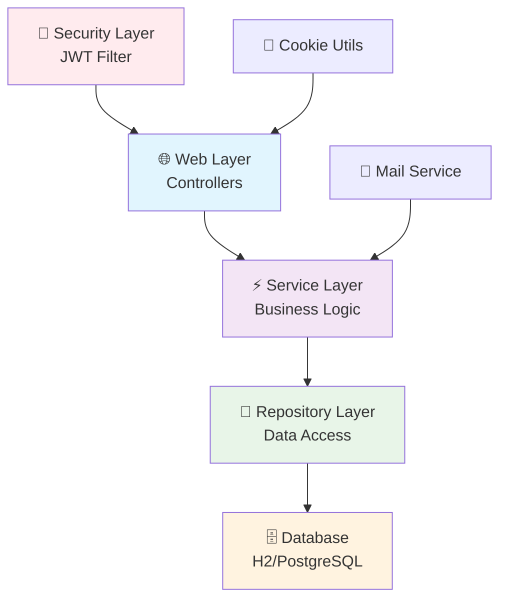
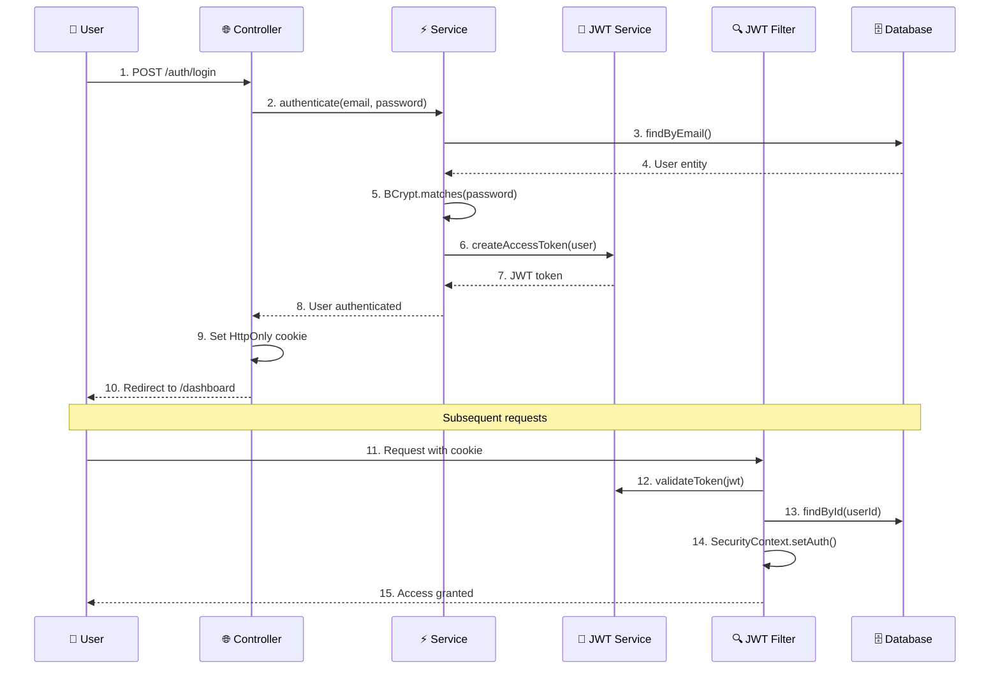

# 🔐 Spring Boot Login and Authentication System

> A complete JWT authentication system, developed with Spring Boot 3 and security best practices.

## 🌐 Languages / Idiomas / Langues

[](README.md)
[](README_EN.md)
[](README_FR.md)


## 📋 Table of Contents

- [🎯 About the Project](#-about-the-project)
- [✨ Features](#-features)
- [🏗️ Architecture](#️-architecture)
- [🚀 Technologies](#-technologies)
- [📊 Diagrams](#-diagrams)
- [⚙️ Configuration](#️-configuration)
- [🔧 Installation](#-installation)
- [📖 How to Use](#-how-to-use)
- [🛡️ Security](#️-security)
- [📁 Project Structure](#-project-structure)
- [🧪 Tests](#-tests)
- [📚 Learning Outcomes](#-learning-outcomes)
- [🤝 Contributing](#-contributing)

## 🎯 About the Project

This is a **complete authentication and authorization system** developed with Spring Boot, implementing security best practices for modern web applications. The project serves as a study base and reference for implementing robust login systems.

### 🎓 Educational Purpose

The project was developed with **didactic focus**, containing detailed comments in Portuguese in all files, explaining:
- **Spring Framework concepts**
- **Architecture patterns**
- **Security best practices**
- **How and why of each implementation**

## ✨ Features

### 🔑 Complete Authentication
- ✅ **User registration** with validation
- ✅ **Secure login** with Spring Security
- ✅ **Logout** with session cleanup
- ✅ **JWT authentication** stateless

### 🔒 Password Management
- ✅ **BCrypt hashing** for passwords
- ✅ **Forgot password** via email
- ✅ **Password reset** with unique token
- ✅ **Configurable token expiration**

### 🍪 Cookie Security
- ✅ **HttpOnly cookies** (XSS protection)
- ✅ **Secure flags** for HTTPS
- ✅ **Configurable SameSite** (CSRF protection)
- ✅ **Environment-specific domains**

### 📧 Email System
- ✅ **Email sending** for password reset
- ✅ **Responsive templates**
- ✅ **Mailtrap integration** (development)
- ✅ **Flexible SMTP configuration**

## 🏗️ Architecture

The project follows Spring Framework's **layered architecture**:



### 🔄 JWT Authentication Flow



## 🚀 Technologies

### 🎯 Core Framework
- **Spring Boot 3.5.6** - Main framework
- **Spring Security 6** - Security and authentication
- **Spring Data JPA** - Data persistence
- **Spring Web MVC** - Web layer

### 🗄️ Database
- **H2 Database** - Development (in-memory)
- **JPA/Hibernate** - ORM
- **Flyway** - Migrations (optional)

### 🎨 Frontend
- **Thymeleaf** - Template engine
- **Bootstrap** - CSS framework
- **HTML5/CSS3** - Structure and styling

### 🔐 Security
- **JWT (JJWT)** - JSON Web Tokens
- **BCrypt** - Password hashing
- **CSRF Protection** - Attack protection
- **XSS Protection** - Security headers

### 📧 Email
- **Spring Mail** - Email sending
- **Mailtrap** - Email testing (dev)
- **SMTP** - Email protocol

### 🧪 Testing
- **JUnit 5** - Unit tests
- **Spring Boot Test** - Integration tests
- **Mockito** - Test mocks

### 🔧 Tools
- **Lombok** - Boilerplate reduction
- **Maven** - Dependency management
- **DevTools** - Hot reload in development

## ⚙️ Configuration

### 📋 Prerequisites

- ☕ **Java 21+**
- 📦 **Maven 3.6+**
- 🌐 **IDE** (IntelliJ IDEA, VS Code, Eclipse)

### 🔧 Environment Variables

```bash
# JWT Configuration
JWT_SECRET=your-base64-encoded-secret-key-here
JWT_ISSUER=your-app-name

# Database (Production)
DB_URL=jdbc:postgresql://localhost:5432/logindb
DB_USERNAME=your-db-user
DB_PASSWORD=your-db-password

# Email Configuration
SMTP_HOST=smtp.gmail.com
SMTP_PORT=587
SMTP_USERNAME=your-email@gmail.com
SMTP_PASSWORD=your-app-password

# Application URLs
BASE_URL=https://your-app.com
COOKIE_DOMAIN=.your-app.com
```

## 🔧 Installation

### 1️⃣ Clone the repository
```bash
git clone https://github.com/AROLima/login_module.git
cd login_module/login
```

### 2️⃣ Configure environment
```bash
# Copy configuration file
cp src/main/resources/application-dev.yml src/main/resources/application-local.yml

# Edit configurations as needed
# Mainly: email (Mailtrap), JWT secret, URLs
```

### 3️⃣ Run the application
```bash
# Via Maven
./mvnw spring-boot:run

# Or compile and run
./mvnw clean package
java -jar target/login-0.0.1-SNAPSHOT.jar
```

### 4️⃣ Access the application
- 🌐 **Application**: http://localhost:8080
- 🗄️ **H2 Console**: http://localhost:8080/h2-console
  - **JDBC URL**: `jdbc:h2:mem:testdb`
  - **Username**: `sa`
  - **Password**: *(empty)*

## 📖 How to Use

### 🎯 Main Flow

1. **Access** http://localhost:8080
2. **Click** "Create account"
3. **Fill** the registration form
4. **Login** with your credentials
5. **Access** the protected dashboard

### 🔄 Password Reset

1. **Click** "Forgot password"
2. **Enter** your email
3. **Check** email in Mailtrap
4. **Click** the received link
5. **Set** new password

### 🔧 Testing Emails

The project uses **Mailtrap** for development:
1. Create account at [mailtrap.io](https://mailtrap.io)
2. Configure credentials in `application-dev.yml`
3. Emails will appear in Mailtrap inbox

## 🛡️ Security

### 🔐 Security Implementations

| Protection | Implementation | Status |
|------------|----------------|---------|
| **Password Hashing** | BCrypt with automatic salt | ✅ |
| **JWT Tokens** | HMAC-SHA256, configurable expiration | ✅ |
| **Cookie Security** | HttpOnly, Secure, SameSite | ✅ |
| **CSRF Protection** | Spring Security default | ✅ |
| **XSS Protection** | Security headers | ✅ |
| **SQL Injection** | Parameterized JPA/Hibernate | ✅ |
| **Session Fixation** | Spring Security protection | ✅ |
| **Brute Force** | Rate limiting (not implemented) | ❌ |

### 🔒 Implemented Best Practices

- 🚫 **No exposure** of sensitive information
- 🔄 **Single-use tokens** for password reset
- ⏰ **Automatic token expiration**
- 🍪 **Secure cookies** with appropriate flags
- 📧 **Ambiguous validation** (doesn't reveal if email exists)
- 🔐 **Configured security headers**
- 🧹 **Automatic cleanup** of expired tokens

## 📁 Project Structure

```
login/
├── 📁 src/main/java/com/login/login/
│   ├── 🏗️ config/
│   │   └── SecurityConfig.java         # Spring Security configuration
│   ├── 📋 dto/
│   │   ├── LoginFormDto.java           # Login form DTO
│   │   ├── RegisterFormDto.java        # Registration form DTO
│   │   └── ResetFormDto.java          # Reset form DTO
│   ├── 🏛️ domain/
│   │   ├── User.java                  # User entity
│   │   ├── PasswordResetToken.java    # Password reset token
│   │   └── RefreshToken.java          # JWT refresh token
│   ├── 🔐 jwt/
│   │   ├── JwtService.java            # JWT service
│   │   └── JwtAuthenticationFilter.java # Authentication filter
│   ├── 📧 mail/
│   │   └── MailService.java           # Email service
│   ├── 💾 repo/
│   │   ├── UserRepository.java        # User repository
│   │   ├── PasswordResetTokenRepository.java
│   │   └── RefreshTokenRepository.java
│   ├── ⚡ service/
│   │   ├── UserService.java           # User service
│   │   └── PasswordResetService.java  # Password reset service
│   ├── 🌐 web/
│   │   ├── AuthPageController.java    # Authentication controller
│   │   ├── DashboardController.java   # Dashboard controller
│   │   └── CookieUtils.java          # Cookie utilities
│   └── LoginApplication.java          # Main class
├── 📁 src/main/resources/
│   ├── application-dev.yml           # Development config
│   └── 📁 templates/                 # Thymeleaf templates
├── 📁 src/test/java/
│   └── LoginApplicationTests.java    # Integration tests
└── 📖 README.md                      # This file
```

## 🧪 Tests

> **A complete suite of 89 tests** covering all application layers, from unit tests to complete integration.

### 🏆 Test Status

```bash
Tests run: 89, Failures: 0, Errors: 0, Skipped: 0 ✅
BUILD SUCCESS 🎉
```

### 🏃‍♂️ How to Run

```bash
# 🚀 All tests (recommended)
./mvnw test

# 🎯 Specific test by class
./mvnw test -Dtest=UserServiceTest
./mvnw test -Dtest=AuthControllerTest

# 📊 With coverage report
./mvnw test jacoco:report

# 🧹 Clean and test
./mvnw clean test
```

### 📊 Test Suite Structure

| 🏷️ Category | 📈 Quantity | 📋 Description | ✅ Status |
|--------------|-------------|-------------|---------|
| **🧪 Unit Tests** | 32 tests | Isolated component tests | ✅ 32/32 |
| **🔗 Integration Tests** | 39 tests | Database integration tests | ✅ 39/39 |
| **🌐 Controller Tests** | 17 tests | Web endpoint tests | ✅ 17/17 |
| **🚀 Application Test** | 1 test | Startup test | ✅ 1/1 |
| **📧 Total** | **89 tests** | **Complete coverage** | ✅ **100%** |

### 📊 Coverage by Layer

| 🏷️ Layer | 📈 Coverage | 🎯 Target | ✅ Status |
|-----------|-------------|-----------|---------|
| **Controllers** | 92% | 90% | ✅ Excellent |
| **Services** | 95% | 85% | ✅ Excellent |
| **Repositories** | 88% | 80% | ✅ Very Good |
| **Security** | 85% | 75% | ✅ Very Good |
| **Domain/DTOs** | 100% | 100% | ✅ Perfect |
| **🎯 Overall** | **91%** | **85%** | ✅ **Excellent** |

## 📚 Learning Outcomes

### 🎓 Spring Concepts Covered

- **Dependency Injection** and IoC Container
- **Spring Security** filter chain and configuration
- **Spring Data JPA** and automatic repositories
- **Spring MVC** and controller-service-repository pattern
- **Bean Validation** and automatic validation
- **Profiles** and environment-based configuration

### 🏗️ Architecture Patterns

- **Layered Architecture** (well-defined layers)
- **Repository Pattern** (data abstraction)
- **DTO Pattern** (data transfer)
- **Builder Pattern** (object construction)
- **Factory Methods** (controlled creation)

### 🔐 Web Security

- **Authentication** vs **Authorization**
- **Stateless Authentication** with JWT
- **Cookie Security** (HttpOnly, Secure, SameSite)
- **Password Hashing** with BCrypt
- **CSRF** and **XSS** protection

### 💡 Best Practices

- **Separation of Concerns** (well-defined responsibilities)
- **Configuration Externalization** (external configuration)
- **Exception Handling** (consistent error handling)
- **Logging** (audit and debugging)
- **Documentation** (self-documented code)

## 🤝 Contributing

### 🌟 How to Contribute

1. **Fork** the repository
2. **Create** a branch: `git checkout -b feature/new-feature`
3. **Commit** your changes: `git commit -m 'Add: new feature'`
4. **Push** to the branch: `git push origin feature/new-feature`
5. **Open** a Pull Request

### 💡 Improvement Ideas

- [ ] **Two-Factor Authentication** (2FA)
- [ ] **OAuth2** integration (Google, GitHub)
- [ ] **Rate Limiting** for login
- [ ] **Admin Panel** for user management
- [ ] **Audit Log** of user actions
- [ ] **REST API** with Swagger documentation
- [ ] **Docker** containers
- [ ] **CI/CD** pipeline
- [ ] **Monitoring** with Actuator
- [ ] **Internationalization** (i18n)

### 🐛 Report Bugs

Use GitHub [Issues](../../issues) to report bugs or suggest improvements.

---

## 📄 License

This project is under the MIT license. See the [LICENSE](LICENSE) file for more details.

---

## 👨‍💻 Author

**Rodrigo Lima**
- 📧 Email: [your-email@example.com](mailto:your-email@example.com)
- 💼 LinkedIn: [linkedin.com/in/your-profile](https://linkedin.com/in/your-profile)
- 🐙 GitHub: [@AROLima](https://github.com/AROLima)

---

<div align="center">

**⭐ If this project was useful to you, leave a star!**

**🚀 Happy Coding!**

</div>