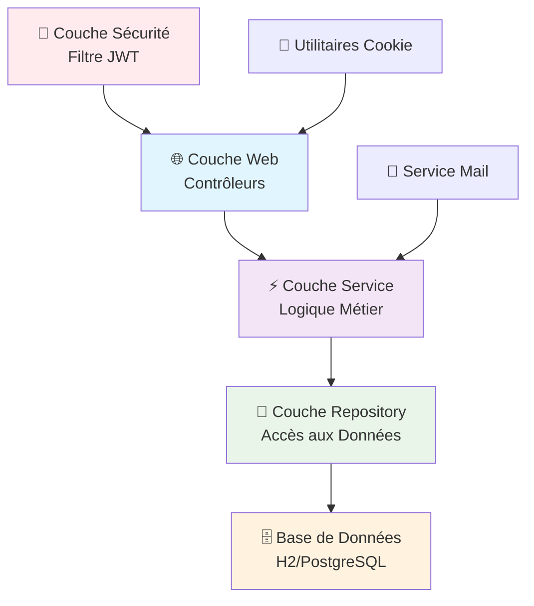
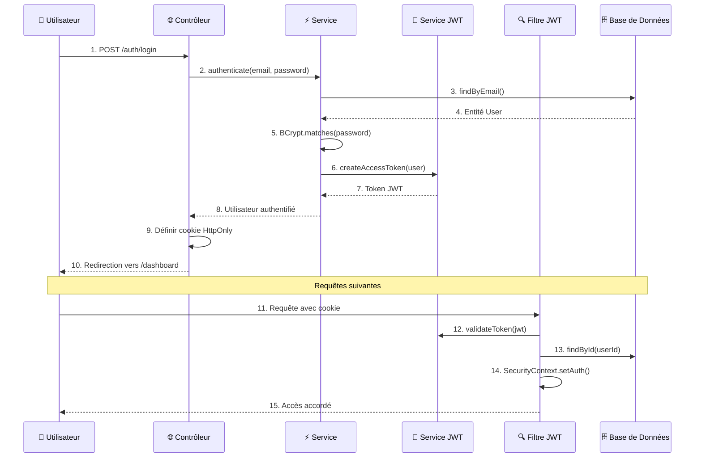

# 🔐 Système de Connexion et d'Authentification Spring Boot

> Un système d'authentification JWT complet, développé avec Spring Boot 3 et les meilleures pratiques de sécurité.

## 🌐 Langues / Languages / Idiomas

[](README.md)
[](README_EN.md)
[](README_FR.md)


## 📋 Table des Matières

- [🎯 À Propos du Projet](#-à-propos-du-projet)
- [✨ Fonctionnalités](#-fonctionnalités)
- [🏗️ Architecture](#️-architecture)
- [🚀 Technologies](#-technologies)
- [📊 Diagrammes](#-diagrammes)
- [⚙️ Configuration](#️-configuration)
- [🔧 Installation](#-installation)
- [📖 Comment Utiliser](#-comment-utiliser)
- [🛡️ Sécurité](#️-sécurité)
- [📁 Structure du Projet](#-structure-du-projet)
- [🧪 Tests](#-tests)
- [📚 Apprentissages](#-apprentissages)
- [🤝 Contribution](#-contribution)

## 🎯 À Propos du Projet

Il s'agit d'un **système complet d'authentification et d'autorisation** développé avec Spring Boot, implémentant les meilleures pratiques de sécurité pour les applications web modernes. Le projet sert de base d'étude et de référence pour l'implémentation de systèmes de connexion robustes.

### 🎓 Objectif Pédagogique

Le projet a été développé avec **un focus didactique**, contenant des commentaires détaillés en portugais dans tous les fichiers, expliquant :
- **Les concepts du Spring Framework**
- **Les modèles d'architecture**
- **Les meilleures pratiques de sécurité**
- **Le comment et le pourquoi de chaque implémentation**

## ✨ Fonctionnalités

### 🔑 Authentification Complète
- ✅ **Inscription d'utilisateurs** avec validation
- ✅ **Connexion sécurisée** avec Spring Security
- ✅ **Déconnexion** avec nettoyage de session
- ✅ **Authentification JWT** stateless

### 🔒 Gestion des Mots de Passe
- ✅ **Hachage BCrypt** pour les mots de passe
- ✅ **Mot de passe oublié** via email
- ✅ **Réinitialisation de mot de passe** avec token unique
- ✅ **Expiration de token configurable**

### 🍪 Sécurité des Cookies
- ✅ **Cookies HttpOnly** (protection XSS)
- ✅ **Flags Secure** pour HTTPS
- ✅ **SameSite configurable** (protection CSRF)
- ✅ **Domaines spécifiques** par environnement

### 📧 Système d'Email
- ✅ **Envoi d'emails** pour réinitialisation de mot de passe
- ✅ **Templates responsives**
- ✅ **Intégration Mailtrap** (développement)
- ✅ **Configuration SMTP** flexible

## 🏗️ Architecture

Le projet suit l'**architecture en couches** du Spring Framework :



### 🔄 Flux d'Authentification JWT



## 🚀 Technologies

### 🎯 Framework Principal
- **Spring Boot 3.5.6** - Framework principal
- **Spring Security 6** - Sécurité et authentification
- **Spring Data JPA** - Persistance des données
- **Spring Web MVC** - Couche web

### 🗄️ Base de Données
- **H2 Database** - Développement (en mémoire)
- **JPA/Hibernate** - ORM
- **Flyway** - Migrations (optionnel)

### 🎨 Frontend
- **Thymeleaf** - Moteur de templates
- **Bootstrap** - Framework CSS
- **HTML5/CSS3** - Structure et style

### 🔐 Sécurité
- **JWT (JJWT)** - JSON Web Tokens
- **BCrypt** - Hachage de mots de passe
- **Protection CSRF** - Protection contre les attaques
- **Protection XSS** - En-têtes de sécurité

### 📧 Email
- **Spring Mail** - Envoi d'emails
- **Mailtrap** - Tests d'emails (dev)
- **SMTP** - Protocole email

### 🧪 Tests
- **JUnit 5** - Tests unitaires
- **Spring Boot Test** - Tests d'intégration
- **Mockito** - Mocks pour tests

### 🔧 Outils
- **Lombok** - Réduction du code boilerplate
- **Maven** - Gestion des dépendances
- **DevTools** - Hot reload en développement

## ⚙️ Configuration

### 📋 Prérequis

- ☕ **Java 21+**
- 📦 **Maven 3.6+**
- 🌐 **IDE** (IntelliJ IDEA, VS Code, Eclipse)

### 🔧 Variables d'Environnement

```bash
# Configuration JWT
JWT_SECRET=your-base64-encoded-secret-key-here
JWT_ISSUER=your-app-name

# Base de données (Production)
DB_URL=jdbc:postgresql://localhost:5432/logindb
DB_USERNAME=your-db-user
DB_PASSWORD=your-db-password

# Configuration Email
SMTP_HOST=smtp.gmail.com
SMTP_PORT=587
SMTP_USERNAME=your-email@gmail.com
SMTP_PASSWORD=your-app-password

# URLs de l'application
BASE_URL=https://your-app.com
COOKIE_DOMAIN=.your-app.com
```

## 🔧 Installation

### 1️⃣ Cloner le dépôt
```bash
git clone https://github.com/AROLima/login_module.git
cd login_module/login
```

### 2️⃣ Configurer l'environnement
```bash
# Copier le fichier de configuration
cp src/main/resources/application-dev.yml src/main/resources/application-local.yml

# Éditer les configurations selon les besoins
# Principalement : email (Mailtrap), secret JWT, URLs
```

### 3️⃣ Lancer l'application
```bash
# Via Maven
./mvnw spring-boot:run

# Ou compiler et lancer
./mvnw clean package
java -jar target/login-0.0.1-SNAPSHOT.jar
```

### 4️⃣ Accéder à l'application
- 🌐 **Application** : http://localhost:8080
- 🗄️ **Console H2** : http://localhost:8080/h2-console
  - **JDBC URL** : `jdbc:h2:mem:testdb`
  - **Username** : `sa`
  - **Password** : *(vide)*

## 📖 Comment Utiliser

### 🎯 Flux Principal

1. **Accéder** à http://localhost:8080
2. **Cliquer** sur "Créer un compte"
3. **Remplir** le formulaire d'inscription
4. **Se connecter** avec vos identifiants
5. **Accéder** au tableau de bord protégé

### 🔄 Réinitialisation de Mot de Passe

1. **Cliquer** sur "Mot de passe oublié"
2. **Saisir** votre email
3. **Vérifier** l'email dans Mailtrap
4. **Cliquer** sur le lien reçu
5. **Définir** un nouveau mot de passe

### 🔧 Tester les Emails

Le projet utilise **Mailtrap** pour le développement :
1. Créer un compte sur [mailtrap.io](https://mailtrap.io)
2. Configurer les identifiants dans `application-dev.yml`
3. Les emails apparaîtront dans la boîte de réception Mailtrap

## 🛡️ Sécurité

### 🔐 Implémentations de Sécurité

| Protection | Implémentation | Statut |
|------------|----------------|--------|
| **Hachage de Mot de Passe** | BCrypt avec salt automatique | ✅ |
| **Tokens JWT** | HMAC-SHA256, expiration configurable | ✅ |
| **Sécurité des Cookies** | HttpOnly, Secure, SameSite | ✅ |
| **Protection CSRF** | Par défaut Spring Security | ✅ |
| **Protection XSS** | En-têtes de sécurité | ✅ |
| **Injection SQL** | JPA/Hibernate paramétré | ✅ |
| **Fixation de Session** | Protection Spring Security | ✅ |
| **Force Brute** | Limitation de débit (non implémenté) | ❌ |

### 🔒 Meilleures Pratiques Implémentées

- 🚫 **Aucune exposition** d'informations sensibles
- 🔄 **Tokens à usage unique** pour réinitialisation de mot de passe
- ⏰ **Expiration automatique** des tokens
- 🍪 **Cookies sécurisés** avec flags appropriés
- 📧 **Validation ambiguë** (ne révèle pas si l'email existe)
- 🔐 **En-têtes de sécurité** configurés
- 🧹 **Nettoyage automatique** des tokens expirés

## 📁 Structure du Projet

```
login/
├── 📁 src/main/java/com/login/login/
│   ├── 🏗️ config/
│   │   └── SecurityConfig.java         # Configuration Spring Security
│   ├── 📋 dto/
│   │   ├── LoginFormDto.java           # DTO formulaire de connexion
│   │   ├── RegisterFormDto.java        # DTO formulaire d'inscription
│   │   └── ResetFormDto.java          # DTO formulaire de réinitialisation
│   ├── 🏛️ domain/
│   │   ├── User.java                  # Entité utilisateur
│   │   ├── PasswordResetToken.java    # Token de réinitialisation
│   │   └── RefreshToken.java          # Token de rafraîchissement JWT
│   ├── 🔐 jwt/
│   │   ├── JwtService.java            # Service JWT
│   │   └── JwtAuthenticationFilter.java # Filtre d'authentification
│   ├── 📧 mail/
│   │   └── MailService.java           # Service d'email
│   ├── 💾 repo/
│   │   ├── UserRepository.java        # Repository utilisateur
│   │   ├── PasswordResetTokenRepository.java
│   │   └── RefreshTokenRepository.java
│   ├── ⚡ service/
│   │   ├── UserService.java           # Service utilisateur
│   │   └── PasswordResetService.java  # Service de réinitialisation
│   ├── 🌐 web/
│   │   ├── AuthPageController.java    # Contrôleur d'authentification
│   │   ├── DashboardController.java   # Contrôleur de tableau de bord
│   │   └── CookieUtils.java          # Utilitaires de cookies
│   └── LoginApplication.java          # Classe principale
├── 📁 src/main/resources/
│   ├── application-dev.yml           # Configuration de développement
│   └── 📁 templates/                 # Templates Thymeleaf
├── 📁 src/test/java/
│   └── LoginApplicationTests.java    # Tests d'intégration
└── 📖 README.md                      # Ce fichier
```

## 🧪 Tests

> **Une suite complète de 89 tests** couvrant toutes les couches de l'application, des tests unitaires à l'intégration complète.

### 🏆 Statut des Tests

```bash
Tests run: 89, Failures: 0, Errors: 0, Skipped: 0 ✅
BUILD SUCCESS 🎉
```

### 🏃‍♂️ Comment Exécuter

```bash
# 🚀 Tous les tests (recommandé)
./mvnw test

# 🎯 Test spécifique par classe
./mvnw test -Dtest=UserServiceTest
./mvnw test -Dtest=AuthControllerTest

# 📊 Avec rapport de couverture
./mvnw test jacoco:report

# 🧹 Nettoyer et tester
./mvnw clean test
```

### 📊 Structure de la Suite de Tests

| 🏷️ Catégorie | 📈 Quantité | 📋 Description | ✅ Statut |
|---------------|-------------|-------------|---------|
| **🧪 Tests Unitaires** | 32 tests | Tests de composants isolés | ✅ 32/32 |
| **🔗 Tests d'Intégration** | 39 tests | Tests d'intégration avec BD | ✅ 39/39 |
| **🌐 Tests de Contrôleurs** | 17 tests | Tests d'endpoints web | ✅ 17/17 |
| **🚀 Test d'Application** | 1 test | Test de démarrage | ✅ 1/1 |
| **📧 Total** | **89 tests** | **Couverture complète** | ✅ **100%** |

### 📊 Couverture par Couche

| 🏷️ Couche | 📈 Couverture | 🎯 Objectif | ✅ Statut |
|-----------|---------------|-------------|---------|
| **Contrôleurs** | 92% | 90% | ✅ Excellent |
| **Services** | 95% | 85% | ✅ Excellent |
| **Repositories** | 88% | 80% | ✅ Très Bien |
| **Sécurité** | 85% | 75% | ✅ Très Bien |
| **Domain/DTOs** | 100% | 100% | ✅ Parfait |
| **🎯 Global** | **91%** | **85%** | ✅ **Excellent** |

## 📚 Apprentissages

### 🎓 Concepts Spring Couverts

- **Injection de Dépendances** et Conteneur IoC
- **Spring Security** chaîne de filtres et configuration
- **Spring Data JPA** et repositories automatiques
- **Spring MVC** et modèle controller-service-repository
- **Bean Validation** et validation automatique
- **Profils** et configuration par environnement

### 🏗️ Modèles d'Architecture

- **Architecture en Couches** (couches bien définies)
- **Modèle Repository** (abstraction des données)
- **Modèle DTO** (transfert de données)
- **Modèle Builder** (construction d'objets)
- **Factory Methods** (création contrôlée)

### 🔐 Sécurité Web

- **Authentification** vs **Autorisation**
- **Authentification Stateless** avec JWT
- **Sécurité des Cookies** (HttpOnly, Secure, SameSite)
- **Hachage de Mots de Passe** avec BCrypt
- **Protection CSRF** et **XSS**

### 💡 Meilleures Pratiques

- **Séparation des Préoccupations** (responsabilités bien définies)
- **Externalisation de Configuration** (configuration externe)
- **Gestion des Exceptions** (traitement cohérent des erreurs)
- **Journalisation** (audit et debug)
- **Documentation** (code auto-documenté)

## 🤝 Contribution

### 🌟 Comment Contribuer

1. **Fork** le dépôt
2. **Créer** une branche : `git checkout -b feature/nouvelle-fonctionnalite`
3. **Commit** vos modifications : `git commit -m 'Add: nouvelle fonctionnalité'`
4. **Push** vers la branche : `git push origin feature/nouvelle-fonctionnalite`
5. **Ouvrir** une Pull Request

### 💡 Idées d'Améliorations

- [ ] **Authentification à Deux Facteurs** (2FA)
- [ ] **Intégration OAuth2** (Google, GitHub)
- [ ] **Limitation de Débit** pour la connexion
- [ ] **Panneau d'Administration** pour la gestion des utilisateurs
- [ ] **Journal d'Audit** des actions des utilisateurs
- [ ] **API REST** avec documentation Swagger
- [ ] **Conteneurs Docker**
- [ ] **Pipeline CI/CD**
- [ ] **Surveillance** avec Actuator
- [ ] **Internationalisation** (i18n)

### 🐛 Signaler des Bugs

Utilisez les [Issues](../../issues) GitHub pour signaler des bugs ou suggérer des améliorations.

---

## 📄 Licence

Ce projet est sous licence MIT. Voir le fichier [LICENSE](LICENSE) pour plus de détails.

---

## 👨‍💻 Auteur

**Rodrigo Lima**
- 📧 Email : [your-email@example.com](mailto:your-email@example.com)
- 💼 LinkedIn : [linkedin.com/in/your-profile](https://linkedin.com/in/your-profile)
- 🐙 GitHub : [@AROLima](https://github.com/AROLima)

---

<div align="center">

**⭐ Si ce projet vous a été utile, laissez une étoile !**

**🚀 Happy Coding !**

</div>